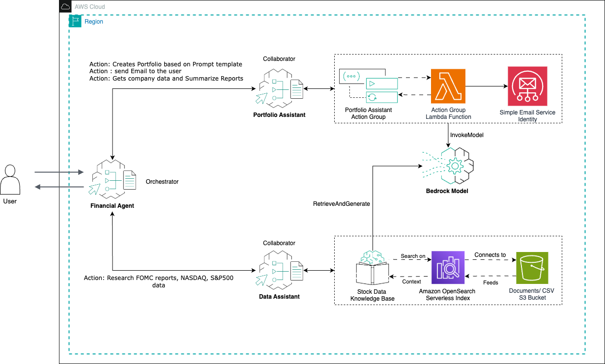

# Financial Analyst and Portfolio system - Multi-Agent example

## Overview
This example showcases Amazon Bedrock Agents' [multi-agent collaboration capabilities](https://docs.aws.amazon.com/bedrock/latest/userguide/agents-multi-agents-collaboration.html) through an efficient system. 
The system consists of a supervisor agent that orchestrates two specialized sub-agents, with each sub-agent focusing on either building portfolios or gathering financial data.

## System Architecture
```
├── 1- Portfolio Agent
├── 2- Knowledge Agent
├── 3- Financial Agent (Supervisor)
└── 4- Clean up# Financial Analyst and Portfolio system - Multi-Agent 
```


## Agents Description

### Financial Agent (Supervisor)
The supervisor agent coordinates the activities of two specialized sub-agents, 
routing customer queries and requests to the appropriate agent while maintaining context and 
ensuring seamless interactions. The architecture looks as following:




### Sub-Agents

#### 1. Portfolio Agent
The Portfolio Assistant Agent performs the following key functions:

* Creates a portfolio with static data that is present with the agent for companies and uses this to create detailed revenue details and other details for the past year. 
* Stakeholder communication management via email


#### 2. Knowledge Agent
The Data Assistant Agent functions as an information repository and data retrieval specialist. Its primary responsibilities include:

* Providing data-driven insights on economic trends, company financial statements, and Federal public documents (FOMC). This is downloadable and can be uploaded to the data folder to be embedded in the knowledge base. 

* Processing and responding to user queries regarding financial data like previous year revenue, stakeholder documents of the company for every fiscal quarter, etc. This is again just static data for the purpose of our experimentation; however, we can stream real-time data using available APIs.


## Prerequisites
- AWS Account with appropriate permissions
- Amazon Bedrock access
- Basic understanding of AWS services
- Python 3.8+
- Latest Boto3 SDK
- AWS CLI configured

## Getting Started
1. Clone this repository
2. Use the sub-Agents Notebook file to create the 2 sub agents that is required. 
3. use the [MultiFinancialagent.ipynb](<Fianancial Assistant Agent/MultiFinancialagent.ipynb>) to run the orchestrator agent. 

For ease of use, you can go ahead and add any data under the data folder to be picked up for the data for knowledge Base. 

## Support
For support and questions, please open an issue in the repository.

---
Note: This example is for educational purposes and demonstrates the capabilities of Amazon Bedrock Agents' multi-agent collaboration feature.

